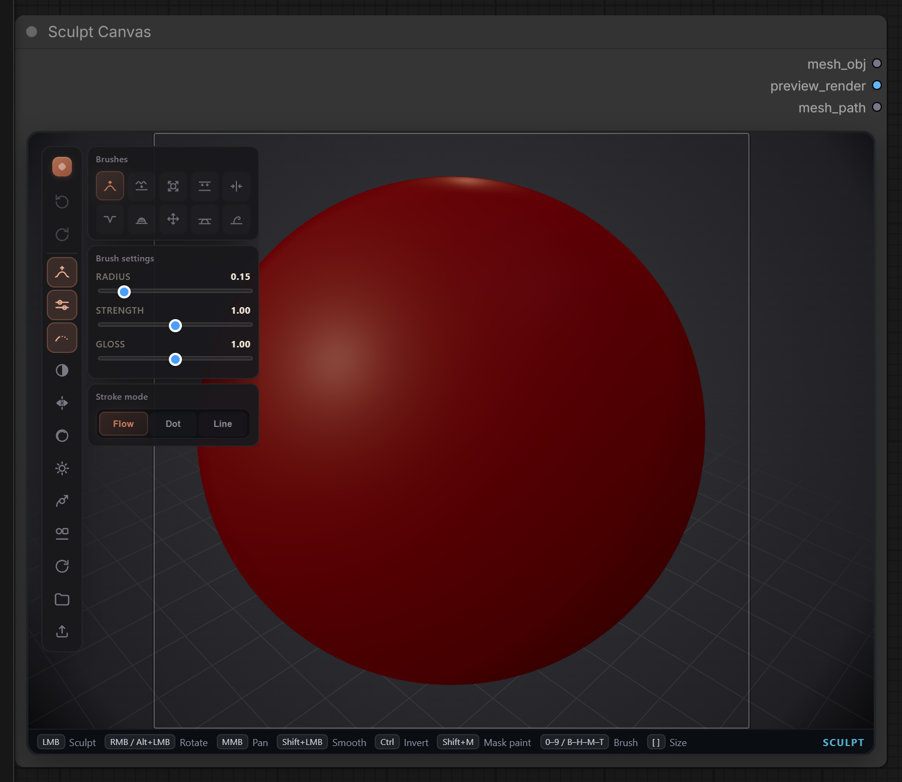
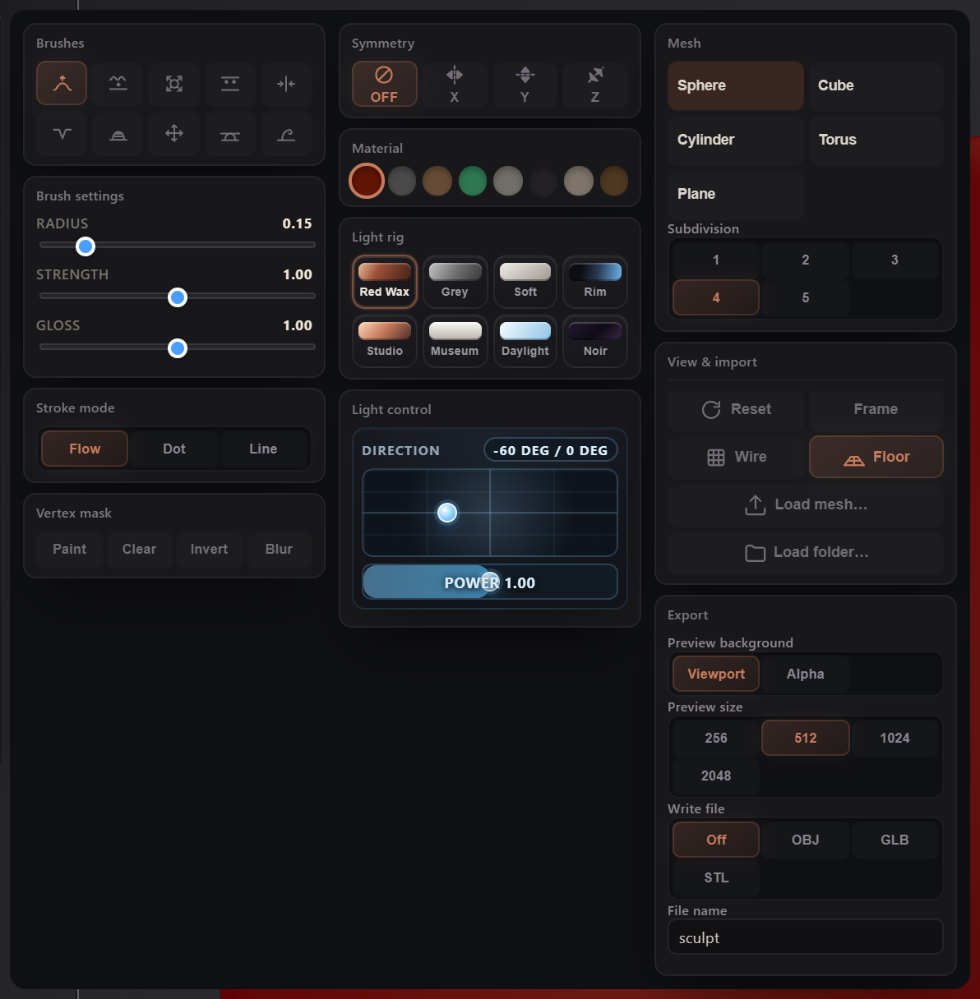

# Sculpt Canvas

A 3D sculpting viewport inside a ComfyUI node. Outputs OBJ text and a preview
image, with optional OBJ, GLB or STL export.

<p align="center">
  
  
</p>

## Installation

### ComfyUI Manager

Search for **Sculpt Canvas** in ComfyUI Manager and click **Install**.

### Manual

```bash
cd ComfyUI/custom_nodes
git clone https://github.com/SKBv0/ComfyUI_SculptCanvas.git
```

Restart ComfyUI afterwards.

## Brushes

Ten brushes, each on a number and a letter key. **Ctrl** runs a brush in
reverse, so Draw carves. **Shift** smooths without switching tools.

- **Draw** `1` `B` and **Clay** `4` `D` build material up
- **Inflate** `3` `I` pushes the surface out along its normals
- **Smooth** `2` `S` and **Flatten** `7` `F` even the surface out
- **Crease** `5` `C` and **Pinch** `8` `P` cut lines and sharpen edges
- **Move** `6` `M` and **Hook** `0` `H` drag a region
- **Trim** `9` `T` cuts toward a plane

Radius, strength and gloss are under the brush grid. `[` and `]` change the
radius. Strokes run continuously, as single dabs, or along a straight line.
Symmetry mirrors across X, Y or Z.

A painted mask keeps the brush off part of the model until you clear, invert or
blur it. **Ctrl+Z** and **Ctrl+Y** undo and redo.

## Camera

- **Left drag** sculpts, **Shift+left** smooths, **Ctrl+left** inverts
- **Right drag** or **Alt+left** orbits, **middle drag** pans, **wheel** zooms
- **Home** refits the mesh and resets the orbit
- **Frame** refits without changing the angle

## Materials

Eight materials, including red wax, grey clay, jade and porcelain, and eight
light rigs. A light pad sets the key light direction and power.

Light rigs affect the viewport only. Exports carry the material colour as you
see it on screen.

## Import

One OBJ, FBX, GLB or glTF at a time, or a folder to include the material file,
binary buffer and textures. Imported geometry is centred and scaled to a unit
sphere; the original position and size are dropped. **Object orientation**
rotates it in quarter turns around X, Y or Z, baked into the mesh and undoable.

An imported texture lasts for the session. It is not stored in the workflow, so
import the images again after reopening.

MTL colours are read and written as linear values, matching Blender.

## Output

- `mesh_obj`: OBJ text with vertices, normals, faces and UVs
- `preview_render`: a square image of the viewport at the size you set; the
  thin square on the viewport shows the crop
- `mesh_path`: path of the exported file, empty when export is off

Files go to the ComfyUI output folder as `sculpt_00001_.obj`, `sculpt_00002_.obj`
and so on.

- **OBJ** with a material file, plus the image when the mesh is textured
- **GLB** as a single file with the texture inside
- **STL** for geometry alone

No FBX writer. GLB opens in the same tools, and Blender converts between them.

## Saving

Meshes under about twelve thousand vertices are stored in the workflow. Larger
ones go to `sculpt/meshes` in the ComfyUI user folder, with a reference in the
workflow, so back that folder up alongside your workflows.

The status line under the viewport shows while a large mesh is still
uploading. A workflow saved during that moment points at the previous copy.

A failed save shows a **Retry** button. The node does not fall back to the
starting shape.

Ceilings are 300,000 vertices and 2,000,000 face indices.

## License

MIT. three.js is bundled for the importers, also MIT.

<details>
<summary>three.js license</summary>

```
MIT License

Copyright (c) 2010-2023 three.js authors

Permission is hereby granted, free of charge, to any person obtaining a copy
of this software and associated documentation files (the "Software"), to deal
in the Software without restriction, including without limitation the rights
to use, copy, modify, merge, publish, distribute, sublicense, and/or sell
copies of the Software, and to permit persons to whom the Software is
furnished to do so, subject to the following conditions:

The above copyright notice and this permission notice shall be included in all
copies or substantial portions of the Software.

THE SOFTWARE IS PROVIDED "AS IS", WITHOUT WARRANTY OF ANY KIND, EXPRESS OR
IMPLIED, INCLUDING BUT NOT LIMITED TO THE WARRANTIES OF MERCHANTABILITY,
FITNESS FOR A PARTICULAR PURPOSE AND NONINFRINGEMENT. IN NO EVENT SHALL THE
AUTHORS OR COPYRIGHT HOLDERS BE LIABLE FOR ANY CLAIM, DAMAGES OR OTHER
LIABILITY, WHETHER IN AN ACTION OF CONTRACT, TORT OR OTHERWISE, ARISING FROM,
OUT OF OR IN CONNECTION WITH THE SOFTWARE OR THE USE OR OTHER DEALINGS IN THE
SOFTWARE.
```

</details>
